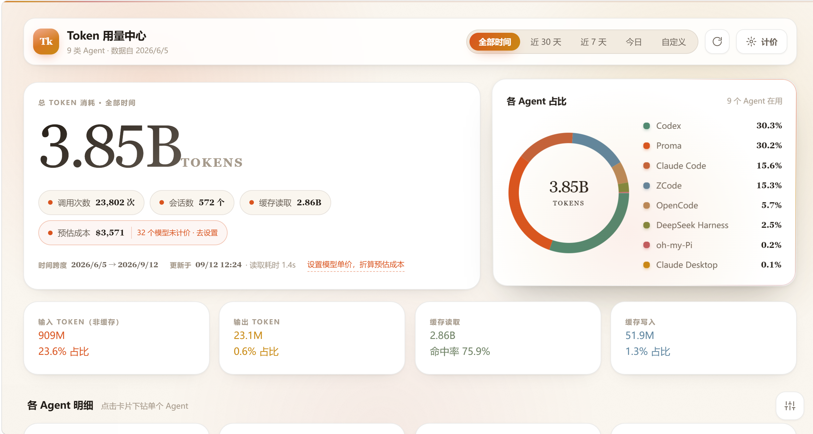

# Agent Token Viewer

**本机 AI 编码 Agent 的 Token 用量总览。**

一个零依赖的本地服务，扫描你机器上各个 Agent 留下的会话文件，把「我到底用了多少 token、花在哪个工具哪个模型上、哪几天用得最凶」在一页里讲清楚。

- **不上传任何数据**，不修改任何文件，**不安装任何依赖**
- 一个 `server.js` + 一个 `index.html`，浏览器打开就是全部
- 支持 9 类 Agent、跨 Windows / macOS / Linux



> 上图是真实数据：9 类 Agent 合计 **3.85B tokens**、23,802 次调用、572 个会话，
> 缓存读取 2.86B（命中率 75.9%），时间跨度 2026/6/5 → 2026/9/12。

---

## 目录

- [快速构建指南](#快速构建指南)
- [快速下载方式](#快速下载方式)
- [一、基本功能](#一基本功能)
- [二、详细功能](#二详细功能)
- [三、具体用途](#三具体用途)
- [四、详细的动效展示](#四详细的动效展示)
- [已实测验证](#已实测验证)
- [支持的数据源](#支持的数据源)
- [统计口径与防重复计数](#统计口径与防重复计数)
- [隐私](#隐私)
- [已知限制](#已知限制)

---

## 快速构建指南

### 前置要求

只需要 **Node.js ≥ 22.15**。

为什么卡这个版本：本项目**零依赖**，靠的是 Node 内置能力——

| 能力 | 用途 | 需要的 Node |
| --- | --- | --- |
| `node:sqlite` | 直读 ZCode / OpenCode 的 SQLite 数据库 | ≥ 22.5 |
| `zlib.zstdDecompressSync` | 解压 DeepSeek Harness 的 `.jsonl.zstd` 会话 | ≥ 22.15 |
| `http` / `readline` / `fs` | 服务与流式解析 | 任意 |

检查：

```bash
node -v          # 需要 v22.15 以上
```

没有的话去 [nodejs.org](https://nodejs.org/) 装 LTS，或用 `fnm` / `nvm` / `volta` 管理版本。

### 方式 A：下载压缩包跑起来（最快，30 秒）

```bash
# 1) 下载
curl -L -o atv.zip https://github.com/kyoka-shuiyue/agent-token-viewer/archive/refs/heads/main.zip

# 2) 解压——三选一，取决于你在哪个环境里
tar -xf atv.zip                  # Windows PowerShell / cmd、macOS 自带可用；
                                 # 注意：Git Bash 自带的是 GNU tar，认不了 zip
cd agent-token-viewer-main
```

在 **Git Bash** 或 **Linux** 里请改用：

```bash
unzip atv.zip && cd agent-token-viewer-main      # Git for Windows 自带 unzip
# 或者——不管什么环境都能用：
python -m zipfile -e atv.zip . && cd agent-token-viewer-main
```

Windows 用户也可以直接对着 zip 文件右键「全部提取」。

```bash
node server.js
```

浏览器会自动打开 <http://127.0.0.1:3457>。Windows 用户直接双击 `start.bat`；
macOS / Linux 用 `bash start.sh`（或先 `chmod +x start.sh` 再 `./start.sh`）。

### 方式 B：git clone

```bash
git clone https://github.com/kyoka-shuiyue/agent-token-viewer.git
cd agent-token-viewer
node server.js
```

### 方式 C：不装任何东西，只看命令行统计

```bash
node server.js --once      # 逐源打印条数 / token 总量 / 主要模型
node server.js --doctor    # 自检：每个数据源的候选路径在不在、读到多少条
```

`--doctor` 输出示例：

```
数据源自检 · win32 · home=C:\Users\you
════════════════════════════════════════════════════════════
✓ Claude Code            73 条     601,326,748 tokens  [ok]
      存在  C:\Users\you\.claude\projects
      存在  C:\Users\you\.claude\stats-cache.json
      备注: 含 15 天的官方按天统计（早期会话文件已被自动清理）
✓ DeepSeek Harness      583 条      97,701,250 tokens  [ok]
      存在  C:\Users\you\AppData\Roaming\dsh-desktop\harness\sessions
      缺失  C:\Users\you\.dsh\sessions
════════════════════════════════════════════════════════════
```

### 常用参数

```bash
# macOS / Linux / Git Bash
TOKEN_VIEWER_PORT=3458 node server.js   # 换端口（默认 3457）

# Windows PowerShell
$env:TOKEN_VIEWER_PORT="3458"; node server.js

# Windows cmd
set TOKEN_VIEWER_PORT=3458 && node server.js
```

```bash
node server.js --once      # 只扫描一次并打印各源统计，不起服务
node server.js --doctor    # 自检：每个数据源的候选路径是否存在、读到多少条
```

### 首次运行会发生什么

1. 自动在 `~/.proma`、`~/.claude`、`~/.codex` 等位置探测数据源（只读）
2. 生成 `pricing-config.json`（内置默认单价，可自行修改）
3. 生成 `.scan-cache.json`（解析缓存，按文件 mtime+size 增量复用）
4. 首次扫描约 5–15 秒（取决于历史体量；实测 1GB 原始日志约 7 秒），之后基本秒开
5. 浏览器打开 <http://127.0.0.1:3457>，进度条会逐个把数据源点亮

### 从源码改

无构建步骤、无打包、无 lint 配置。改完自查：

```bash
node --check server.js          # 语法
node server.js --doctor         # 数据源是否仍全部命中
node server.js --once           # 合计有没有异常翻倍/暴跌
```

前端直接改 `index.html`（CSS 与 JS 都内联在里面），刷新浏览器即可生效。

---

## 快速下载方式

| 方式 | 链接 / 命令 | 适合 |
| --- | --- | --- |
| 源码 ZIP | `https://github.com/kyoka-shuiyue/agent-token-viewer/archive/refs/heads/main.zip` | 想直接解压跑 |
| 源码 tar.gz | `https://github.com/kyoka-shuiyue/agent-token-viewer/archive/refs/heads/main.tar.gz` | Linux/macOS |
| git clone | `git clone https://github.com/kyoka-shuiyue/agent-token-viewer.git` | 想跟版本、提 PR |
| 指定 Release | `https://github.com/kyoka-shuiyue/agent-token-viewer/releases/latest/download/agent-token-viewer.zip` | 想要稳定版（解压后目录名 `agent-token-viewer-v1.0.0`） |
| 只取两个核心文件 | 见下方「极简下载」 | 极简党 |

**极简下载**（只要两个文件，放同一目录就能跑）：

```bash
curl -LO https://raw.githubusercontent.com/kyoka-shuiyue/agent-token-viewer/main/server.js
curl -LO https://raw.githubusercontent.com/kyoka-shuiyue/agent-token-viewer/main/index.html
node server.js
```

### 国内网络加速

GitHub 直连慢时，把域名换成任意加速前缀（以 `ghfast.top` 为例，你也可换自己信任的镜像）：

```bash
# 下载 ZIP
curl -L -o atv.zip https://ghfast.top/https://github.com/kyoka-shuiyue/agent-token-viewer/archive/refs/heads/main.zip

# clone
git clone https://ghfast.top/https://github.com/kyoka-shuiyue/agent-token-viewer.git

# 单个文件
curl -L -o server.js https://ghfast.top/https://raw.githubusercontent.com/kyoka-shuiyue/agent-token-viewer/main/server.js
```

静态文件也可走 jsDelivr CDN：

```
https://cdn.jsdelivr.net/gh/kyoka-shuiyue/agent-token-viewer@main/server.js
https://cdn.jsdelivr.net/gh/kyoka-shuiyue/agent-token-viewer@main/index.html
```

> 本项目**不需要 npm 安装任何依赖**，所以没有 `node_modules`、没有 lockfile、不需要配 registry 镜像。
> 下载即用。

---

## 一、基本功能

1. **多 Agent 统一总览**
   一次扫描把 9 类 Agent 的用量合并成可比较的同一套指标：Proma、Pi、oh-my-Pi、Claude Code、Claude Desktop、Codex、ZCode、DeepSeek Harness、OpenCode。

2. **总量与占比一眼可见**
   页面顶部一个大数字（总 token），配调用次数、会话数、缓存读取、预估成本四枚胶囊，右侧是各 Agent 占比环图与图例。

3. **单个 Agent 下钻**
   点任意 Agent 卡片进入详情页：趋势图、类型分布、模型明细、每日热力、会话清单。

4. **任意时间段**
   全部时间（从最早一条记录到现在）/ 近 30 天 / 近 7 天 / 今日 / 自定义起止日期，切换即时重算，无需重新扫描。

5. **成本估算**
   给每个模型填四类单价，自动折算预估成本；未计价的模型会被明确提示，不会假装成 0。

6. **纯本地、零依赖**
   只用 Node 内置模块，前端不加载任何 CDN 与外部字体；断网也能跑。

---

## 二、详细功能

### 2.1 总览页

| 区域 | 内容 | 细节 |
| --- | --- | --- |
| 顶栏 | 品牌区、时间区间胶囊、重新扫描、计价 | 品牌副标题会显示「N 类 Agent · 数据自 最早日期」；滚动后顶栏加投影 |
| 主数字卡 | 总 token、四枚指标胶囊、时间跨度、更新时间与读取耗时、计价入口 | 数字用衬线字体 + `tabular-nums`，滚动时逐位补间；「32 个模型未计价 · 去设置」可点 |
| 占比环图 | 各 Agent 份额 + 图例百分比 | 每段独立扫出动画；占比 <0.3% 的段自动跳过避免噪点 |
| 四张统计磁贴 | 输入 / 输出 / 缓存读取 / 缓存写入 | 左侧色条标识类别；缓存磁贴额外显示命中率 |
| Agent 卡片网格 | 每个 Agent 一张卡 | 含总量、占比条、调用次数、会话数、缓存读取、成本、近 30 日迷你折线；无数据显示「暂无数据」，未安装显示「未安装」 |
| 页脚 | 只读声明 + 逐源状态 | 每个 Agent 的条数与文件数，状态点着色 |

### 2.2 下钻详情页

- **四张统计卡**：Token 总量（含精确到个位的展开值）、调用次数与会话数、缓存命中率、预估成本。
- **用量趋势图**：
  - 维度可切「按模型」（默认，前 6 个模型 + 「其他 N 个模型」归集，保证图内合计恒等于真实总量）或「按 Token 类型」
  - 粒度可切「自动 / 按日 / 按月」；自动按**补全后的时间桶数量**判断（>45 桶转按月），避免上百根细线
  - 无数据的月份也会占位，横轴间距真实
  - 悬停任意色段显示「日期 · 类别 · 精确数值」
  - 图下方常驻一行：`按月 · 4 个时间桶 | 图内合计 1.16B tokens`，便于对账
- **Token 类型分布环图**：四类占比，含推理 token 的说明行（标注它已并入输出）。
- **模型明细**：横向条形排行，显示每个模型的量与占比。
- **每日用量热力图**：锚定当前时间窗口逐日成格，**未使用的日子保留空白格**；按周一对齐分列、整体居中；带「少 → 多」色阶图例；悬停显示当日精确值。
- **会话明细表**：按用量排序（最多 40 条），显示会话标题（能读到真名就显示真名，如 Codex 的 `session_index.jsonl`、Claude Desktop 的 `local_*.json`、DSH 的 `session/title` 事件）、所用模型、调用次数、token、成本、最近活动时间。
- 详情页顶部会显示该 Agent 的**口径备注**（例如 Claude Code 会提示"含官方按天统计，早期文件已被清理"）。

### 2.3 时间维度

- 五档：全部时间 / 近 30 天 / 近 7 天 / 今日 / 自定义
- 自定义按自然日、含起止当天，日期输入框默认填「最早记录日 → 今天」
- 全部时间的上界取到 `Number.MAX_SAFE_INTEGER`，保证"从最开始到现在"一条不漏
- 切换后所有数字重新补间、图表重新生长，不是硬刷新

### 2.4 计价配置

三个入口都能打开：右上角「计价」按钮、成本胶囊、大数字下方的橙色虚线文字。

- 一行一个模型，四列单价：**输入 / 输出 / 缓存读取 / 缓存写入**，单位 **美元 / 每百万 token**
- 行名右侧灰色小字是该模型总用量，**列表按用量从大到小排**，先填前几行成本就明显变准
- 留空 = 未计价（计入 0 并被提示），填 `0` = 免费
- 模型名匹配会自动去掉 `[渠道前缀]`、`provider/` 前缀与 `-thinking` / `-high` / `-free` 等后缀，再做最长前缀匹配——中转渠道自定义名也能命中
- 自带成本的记录（Pi、OpenCode、Claude Desktop）优先用真实成本，不重复折算
- 保存写入 `pricing-config.json`，全页成本即时重算

### 2.5 性能与增量

- **行级预过滤**：先对原始行做 `includes('"usage"')` 再 `JSON.parse`，否则 Codex/ZCode 几百 MB 的流式噪声会拖死首次扫描
- **文件级缓存**：按 `mtime + size` 复用解析结果，只重扫变化的文件（实测首次 7s → 二次 0.6s → 增量 1.4s）
- **流式读取**：`readline` 逐行，不把大文件整体读进内存
- **只读 SQLite**：`node:sqlite` 的 `readOnly` 模式，即使目标工具正在运行也不冲突
- **多帧 zstd**：按 magic `28 B5 2F FD` 切帧逐段解压（DeepSeek Harness 是追加写入的多帧流，整块解只出第一帧）

### 2.6 动效开关与无障碍

右下角滑杆面板四个开关：**悬停 3D 倾斜** / **流光与光斑** / **数字滚动** / **全部减弱**。
系统开启「减少动态效果」（`prefers-reduced-motion`）时自动进入减弱模式并把动画压到接近 0。

---

## 三、具体用途

### 3.1 成本与预算

- **想知道自己一个月烧了多少 token**：全部时间 / 近 30 天直接给总数与调用次数。
- **想知道钱花在哪个工具上**：占比环图 + 各 Agent 卡片，一眼看出谁是大头。
- **想知道哪个模型最贵**：下钻到模型明细排行，配合单价就是账单。
- **多渠道比价**：同一个模型在不同渠道（中转、订阅、官方）的用量分开统计，可据此决定主力渠道。
- **控制缓存浪费**：缓存命中率单独成指标。命中率低说明系统提示/上下文频繁重建，可以精简 AGENTS.md、减少一次性超长上下文。

### 3.2 用量审计与排错

- **排查异常消耗**：某个 Agent 突然暴涨，趋势图 + 每日热力能定位到具体日期，再点会话表看是哪个会话。
- **验证工具是否真在干活**：自动化任务/定时任务是否真的跑过、跑了多少轮，看调用次数与最近活动时间即可。
- **发现"没数据"的真相**：`--doctor` 会列出每个源的候选路径存在与否，直接区分「没装」「没用过」「数据放在别处」。
- **核对官方统计**：本项目逐条独立解析，可与工具自带面板对账（例如 Claude Code 的 `/stats`）。

### 3.3 多工具并存的现实需求

- 同时用 Claude Code + Codex + 各家桌面端时，**没有任何一家会告诉你跨工具的总量**，这是本项目存在的核心理由。
- 换机器前想留档：`--once` 的输出、`pricing-config.json` 与缓存文件即可完整复现一份用量快照。
- 团队/社群分享配置：把 `pricing-config.json` 发给同事，大家的成本口径就一致了。

### 3.4 二次开发底座

- 数据源图谱（[docs/data-sources.md](docs/data-sources.md)）本身就是逆向各 Agent 存储格式的现成资料，可直接用于做导出、备份、上下文分析、提示词审计等工具。
- 适配器结构清晰，加一个新 Agent 只需实现一个 `scan()`（见 [docs/adding-an-adapter.md](docs/adding-an-adapter.md)）。
- 前端是单文件手写 SVG 图表，可整块搬走做自己的仪表盘。

### 3.5 不适合用它做什么

- 不做实时告警（它是扫描式的，需要手动或定时刷新）。
- 不做云端聚合（只读本机文件）。
- 不替代各家账单：成本是**按你填的单价折算的估算值**，未计价模型不计入。

---

## 四、详细的动效展示

设计取向：**暖白人文感**（米白纸底 + 白卡片 + 陶土橙/焦糖暖色点缀 + 衬线数字），动效追求"看得见但不吵"。
所有动效一律走 `transform / opacity` 的 GPU 合成路径；**不使用全屏 Canvas 逐帧绘制，也不大面积使用 `backdrop-filter`**（只有顶栏与弹层用毛玻璃）。

### 4.1 环境层（持续、低打扰）

| 动效 | 表现 | 实现 |
| --- | --- | --- |
| 顶部流光带 | 一条 45% 宽的暖色渐变光带从左侧扫入、横穿顶部，9 秒一轮，循环不息 | 子元素 `translate3d` 位移，`animation: sheen 9s linear infinite` |
| 背景光斑 | 三团巨型径向渐变（陶土橙 / 焦糖 / 干玫瑰）在页面四角缓慢漂移并轻微呼吸缩放，周期 46s / 56s / 64s，互不同步 | 纯 CSS 径向渐变 + `transform` 动画，`will-change: transform` |
| 纸纹 | 整页覆盖一层极淡的 SVG `feTurbulence` 噪点，营造纸张质感 | 静态背景图，`opacity: .3`，无动画 |
| 顶栏状态 | 页面向下滚动超过 8px 时，顶栏加深底色与投影，产生"浮起来"的层次 | 监听 scroll 切换 `.scrolled` 类 |

### 4.2 入场与页面切换

| 动效 | 表现 | 参数 |
| --- | --- | --- |
| 错落入场 `rise` | 卡片依次从下方 22px 浮起并轻微放大到正常，一张接一张，不是一次性砸出来 | `0.75s`，`cubic-bezier(.22,1,.36,1)`，每张延迟 `index × 55~60ms` |
| 视图切换 `viewIn` | 总览 ↔ 下钻、切换时间区间时，整个内容区重新播放一次上浮淡入，过渡连贯不生硬 | `0.55s`，通过强制回流重放 |
| 弹层弹出 `pop` | 计价表、自定义时间、动效面板从下方 18px 缩放淡入 | `0.45s`，遮罩 `blur(5px)` 淡入 |
| Toast | 从底部上浮 22px 并淡入，2.6 秒后自动退场 | `0.45s` |

### 4.3 数字与图表生长

| 动效 | 表现 | 实现细节 |
| --- | --- | --- |
| 数字滚动 | 大数字从上一个值补间到新值（如 3.85B 从旧值滚上来），切换区间时能看清"变了多少" | `requestAnimationFrame` + 指数缓出 `1-2^(-10t)`，900ms；`lining-nums tabular-nums` 防抖动；后台标签 rAF 被节流时用超时兜底写终值 |
| 环形图扫出 | 占比环从 12 点方向起，每一段依次把 `stroke-dasharray` 从 0 拉到目标弧长，像被逐段画出来 | 每段 `1s`，段间延迟 70–90ms |
| 堆叠柱生长 | 每根柱子从基线 `scaleY(0) → 1` 长起来，桶与桶、段与段之间有细微错峰 | `0.9s`，延迟 `桶序号×22ms + 段序号×14ms`，上限 700ms |
| 迷你折线描绘 | 卡片里的 30 日小折线像被一笔画出，末端落一个圆点 | `stroke-dasharray/dashoffset` 过渡 `1.2s` |
| 横向条展开 | 模型明细的条形从 0 宽长到目标宽度，行间递进 | `1s`，每行延迟 45ms |
| 热力图逐格点亮 | 格子从 `scale(0.4)` + 透明放大淡入，像日历被一天天填上 | 每格延迟 5–7ms，总时长封顶 900ms |
| 占比条 | 卡片底部份额条从 0 拉到真实占比 | `scaleX` 过渡 `1s` |

### 4.4 悬停手感（本项目最花心思的部分）

| 动效 | 表现 | 实现 |
| --- | --- | --- |
| 3D 倾斜 | 鼠标在卡片上移动时，卡片像一张被手指按动的纸：随光标位置做 ±5.5° 的 `rotateX/rotateY`，并跟随平移 ±5px；移开自动回弹归位 | `perspective(900px)` + CSS 变量 `--rx/--ry/--tx/--ty`，`transition: transform .22s` |
| 跟随高光 | 卡片表面有一团暖色柔光跟着光标走，边缘不受影响 | `radial-gradient(340px circle at var(--mx) var(--my))`，hover 时 `opacity 0→1`（.45s） |
| 旋转流光描边 | hover 时卡片**边框**上有一道光沿边缘转圈，像镀了一层流动金属 | `conic-gradient(from var(--ang))` + `@property --ang` + `mask-composite: exclude` 只留 1.2px 边环，hover 时 `orbit 3.4s linear infinite` |
| 按压反馈 | 按下瞬间整卡轻微收缩，松手弹回 | `.press { transform: scale(.985) }` |
| 抬升与阴影 | hover 时卡片上浮 6px、阴影从贴到远，边界变亮 | `translateY(-6px)` + 两档阴影变量 |
| 徽标微交互 | Agent 图标 hover 时放大并轻微旋转，显得"活" | `scale(1.08) rotate(-4deg)`，回弹曲线 `cubic-bezier(.34,1.4,.64,1)` |
| 磁吸按钮 | 主按钮、图标按钮、指标胶囊会朝光标方向轻微吸附 | 位移上限约 5px，离开归零 |
| 图表取数 | 悬停任意柱/格/段：该元素提亮（`filter: brightness(1.14) saturate(1.15)`），并弹出跟随光标的浮层显示精确数值 | 提亮用 filter 而非改透明度——避免重叠区被二次绘制成暗带 |

### 4.5 加载过程本身也是动效

启动不是白屏转圈，而是一段"正在读取本机 Agent 数据"的过场：

- 中央方形徽标做 3.2 秒呼吸缩放，光晕随之强弱
- 进度条是流动的三色渐变（陶土橙→焦糖→干玫瑰），底色 `background-position` 2.4 秒循环
- 九个 Agent 名字排成一行标签：正在读的**上浮并变橙高亮**，读完的**变绿**，未安装的保持灰
- 完成后整块 0.6 秒淡出隐藏，同时把数据接给总览页——所以你会看到内容"接着长出来"，而不是突然替换

### 4.6 图表的接缝处理（一个容易翻车的细节）

堆叠柱若给每段各自圆角，交界处会出现缺口；若为了不留缝而让相邻段重叠，配合半透明填充又会在重叠处画出一条暗带。

本项目的做法：**整根柱子用一个 `clipPath` 只圆顶部**，段与段**精确相邻不重叠**，填充不透明并加 `shape-rendering: crispEdges` 消除抗锯齿白线；悬停提亮改用 `filter` 而不是改透明度。
结果：交界处既无缝也无暗带，实测接缝偏差为 0。

### 4.7 性能与降级

- 全部动画只碰 `transform / opacity`，不触发布局重排
- 页面切到后台时暂停 rAF 循环；数字动画有兜底，不会停在中间值
- 右下角可逐项关闭：3D 倾斜 / 流光与光斑 / 数字滚动
- 「全部减弱」一键把动画压到 0.001s 并冻结背景与光带
- 系统级 `prefers-reduced-motion: reduce` 自动进入减弱模式

---

## 已实测验证

下面这些都在真实环境跑通过（Windows + Git Bash，Node v22.22.3）：

| 项 | 结果 |
| --- | --- |
| 下载 main.zip / main.tar.gz | HTTP 200 |
| Release 资产 zip | HTTP 200，解压得 `agent-token-viewer-v1.0.0/` |
| raw / jsDelivr / ghfast 镜像单文件 | HTTP 200 |
| 解压后的副本跑 `node server.js --once` | 正常，9 源全部命中，5.3s |
| 解压后的副本起服务 | `GET /` 200、`/api/status` 200（ready 9/9）、`/api/data` 200 |
| `node --check server.js` | 通过 |
| `bash -n start.sh` / 换行符 | 语法通过；全仓库 LF，无 CRLF 污染 |
| 发布包内容 | 不含 `.scan-cache.json` 与 `pricing-config.json`（不泄露本地用量与私有定价） |

两个坑已经写进上面的说明（不是 bug，是环境差异）：

1. **Git Bash 里的 `tar` 认不了 zip**（它是 GNU tar），请用 `unzip` 或 `python -m zipfile`；Windows PowerShell / cmd 的 `tar.exe` 是 bsdtar，可以解 zip。
2. **`TOKEN_VIEWER_PORT=xxx node ...` 是 POSIX 写法**，Windows cmd / PowerShell 要用各自的环境变量语法（上面已给三种）。

---

## 支持的数据源

| Agent | 数据在哪 | 用量字段 |
| --- | --- | --- |
| Proma | `~/.proma/agent-sessions/`、`~/.proma-dev/agent-sessions/` | `message.usage` |
| Pi | `~/.pi/agent/sessions/` | `message.usage` |
| oh-my-Pi | `~/.omp/agent/sessions/` | `message.usage` |
| Claude Code | `~/.claude/projects/` **+ `~/.claude/stats-cache.json`** | `usage` / `dailyModelTokens` |
| Claude Desktop | `<本地应用数据>/Claude-3p/local-agent-mode-sessions/**/usage-ledger/*.ndjson` | `models[模型].*Tokens` |
| Codex | `~/.codex/sessions/` + `~/.codex/archived_sessions/` | `total_token_usage` |
| ZCode | `~/.zcode/cli/db/db.sqlite` 表 `model_usage` | 独立列 |
| DeepSeek Harness | `<应用数据>/dsh-desktop/harness/sessions/**/session.jsonl.zstd` | `data.usage` |
| OpenCode | `~/.local/share/opencode/opencode.db` 表 `message` | `tokens` |

完整路径清单（含跨平台变体、桌面版与 CLI 版差异、可覆盖的环境变量）、字段的确切 JSON 路径、压缩格式、以及每个源踩过的坑，都在
**[docs/data-sources.md](docs/data-sources.md)**。新增数据源前请先读它，改完请回来补它。

## 统计口径与防重复计数

各家 `usage` 定义不一致，直接相加会算错。本项目统一折算成四类可比指标：

```
总量 = 非缓存输入 + 输出 + 缓存读取 + 缓存写入
```

- Codex 的 `input_tokens` **包含**缓存命中 → 拆成 `input - cached` 与 `cached`
- OpenCode 的 `reasoning` 是**独立相加项** → 并入输出并单独展示
- Pi / Codex 的 `reasoning` **已含在 output 内** → 只展示不再加

已处理的重复计数陷阱：

| 情况 | 后果 | 处理 |
| --- | --- | --- |
| Proma 同一轮同时写 `assistant` 与 `result` | 翻倍 | 只取 `assistant`，按 `uuid` 去重 |
| Codex 续聊重开文件并重放历史 | 严重翻倍 | 按 `session_id` 取最完整一份，对累计值做差分 |
| DeepSeek Harness 的 `assistant/chunk` 回声 | 翻倍 | 只取 `assistant/message` |
| Claude Desktop 账本与 Claude Code 同一会话 | 跨源重复 | 账本优先，被覆盖的 `cliSessionId` 从 Claude Code 排除 |
| Claude Code 旧会话文件被自动清理 | 低估两个数量级 | 改用其 `stats-cache.json` 按天统计兜底，并在 UI 标注 |

详见 [docs/units.md](docs/units.md)。

## 隐私

- 所有数据源**只读**，不写入、不删除、不上传；缓存与配置只写在本项目目录内。
- 服务只监听 `127.0.0.1`，不对外网开放。
- 前端不加载任何 CDN、外部字体或统计脚本，断网可用。
- 本地缓存 `.scan-cache.json` 只含：时间戳、模型名、五类 token 数、会话 ID（UUID）、已知成本。
  **不含对话内容、不含 prompt 文本、不含文件路径、不含密钥**，且已被 `.gitignore` 排除。
- 会话标题每次扫描现读、不落盘；若不想读取标题，注释掉各适配器里的 `sessions` 收集即可。

## 已知限制

1. **Claude Code 的历史会被它自己清理**：旧会话文件删除后无法回补。本项目用它的 `stats-cache.json` 按天统计兜底（四类拆分按比例估算，UI 明确标注），但缓存覆盖不到的日期仍然取不到。
2. **工具没产生本地记录时就显示"暂无数据"**：先跑 `--doctor` 看路径是否存在。
3. **单价必须你自己填**：模型名常是中转渠道自定义的名字，程序不猜价格；留空即未计价。
4. **跨平台路径靠候选列表探测**：新出现的桌面端目录名可能不在候选里，遇到请补文档并提 PR。

## 项目结构

```
server.js      扫描服务 + 9 个数据源适配器（零依赖，约 1000 行）
index.html     界面（内联 CSS/JS，手写 SVG 图表，不加载任何 CDN）
docs/
  data-sources.md        数据源图谱：路径、格式、字段、坑（本项目最核心的资产）
  units.md               统一计量口径与去重规则
  adding-an-adapter.md   如何新增一个 Agent
  screenshot.png         界面截图
pricing.example.json     单价配置样例
start.bat / start.sh     一键启动
```

## 贡献

见 [CONTRIBUTING.md](CONTRIBUTING.md)。最有价值的贡献是**补全数据源**。

## 许可证

[MIT](LICENSE)
